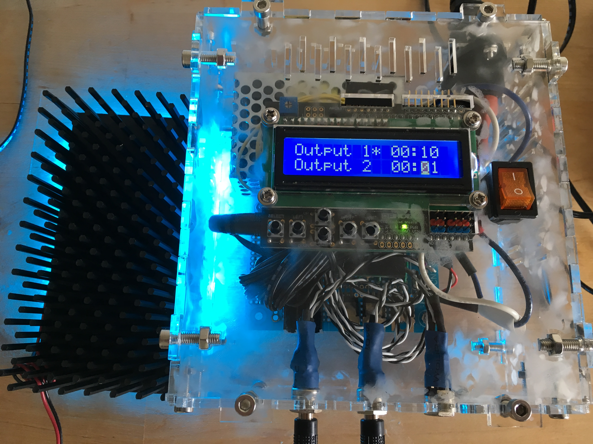
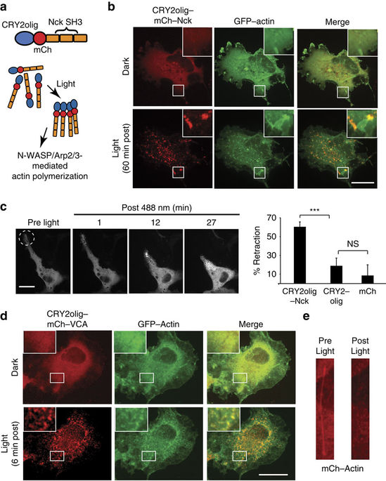
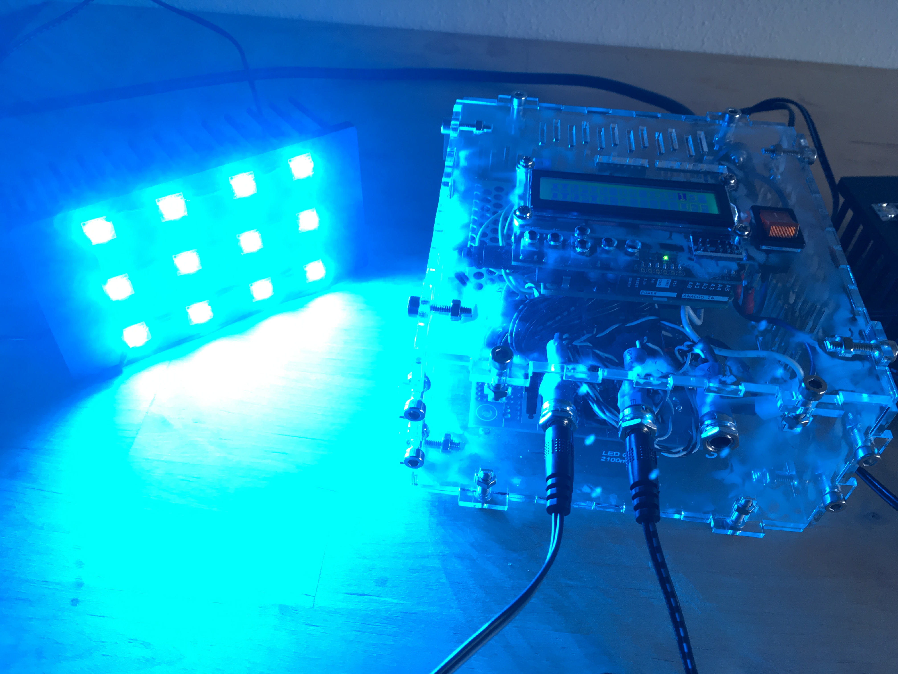
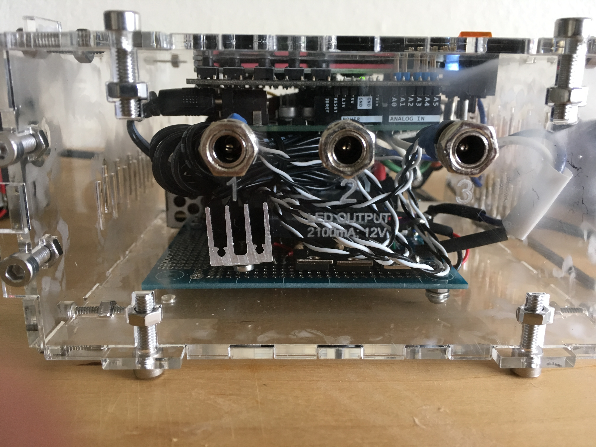
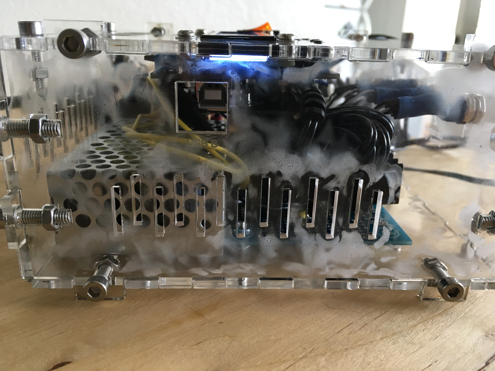
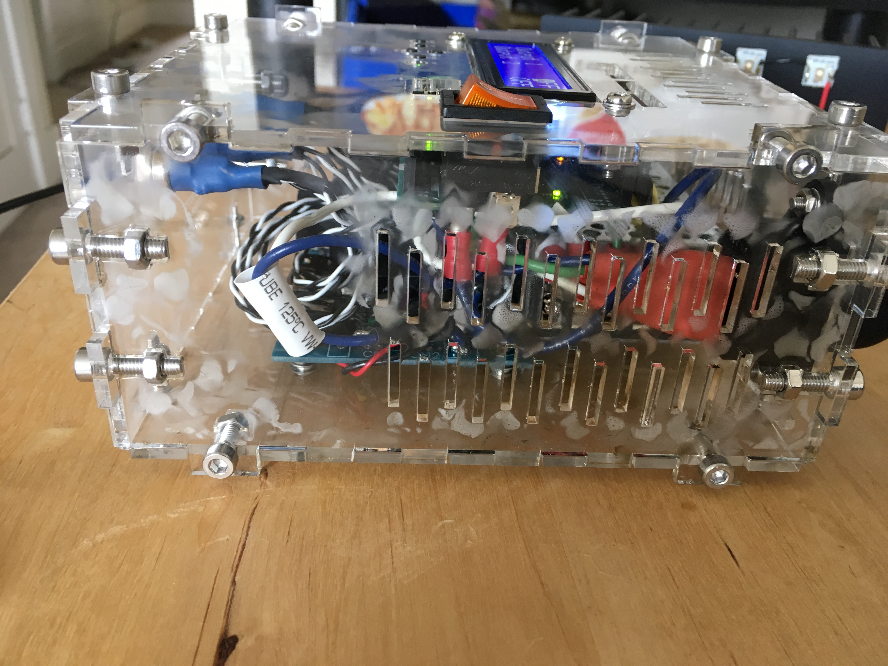
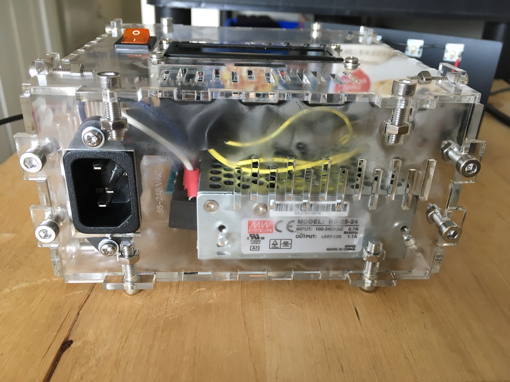

# OptogeneticsLightBox
A programmable light delivery box for optogenetics experiments. This small and cheap light delivery system was used in several publications [1,2,3,4,5,6](#references)

## Features:

* three independent programmable LED outputs
    * program pulse length, interval, intensity
* powerful 700mA LEDs
* convinient LCD screen

## Repo Contents
* [Arduino code](src/LEDProgrammer_V2-32.ino)
* [Laser cutter files](design/lasercutter)
* [Materials list](design/LEDControllerPartsList.xlsx)
* [Gallery](Gallery.md)

## Using the Light Box:

**Changing cell shape using light.** Proteins involved with
actin polymerization (SH3) were fused to a mutant plant protein that
clusters in reponse to blue light. Constructs were transfected into monkey cells
and ths Light Box was used to pulse blue light with the hypothesis that clustering
SH3 domains would recruit other proteins involved with actin polymerization and disrupt
the surrounding cytoskeleton. The figure below demonstrates this and shows that, as
a result, we can also alter cell shape using light.

[Taslimi, A., Vrana, J. D., et al. An optimized optogenetic clustering tool for probing protein interaction and function. Nature communications 5, 4925 (2014).](https://www.nature.com/articles/ncomms5925)

a) Strategy for clustering Nck SH3 domains. (b) Cells expressing
CRY2olig–mCh–Nck and GFP–actin in dark, or 60 min post blue light
(500 ms pulse, 488 nm, every 3 min). Scale bar, 20 μm. (c) Local
photostimulation (within circle) of COS-7 cell expressing CRY2olig–mCh–Nck
results in retraction of cell extension. Graph at right shows
quantification of retraction (average and s.e.m., n=16) in cells
 expressing CRY2olig–mCh–Nck, or controls CRY2olig–mCh or mCherryN1
  45 min post initial light exposure. ***P<0.001. NS, not significant.
  (d) Cells expressing CRY2olig–mCh–VCA, CRY2olig and GFP–actin in
  dark or 6 min post blue light (500 ms pulse, 488 nm, every 3 min).
  Inset images at right show detail within white square. Scale bar,
  20 μm. (e) Stress fibres within cells expressing CRY2olig–GFP–VCA,
  CRY2olig and mCherry–actin are disrupted with light exposure.

## Gallery

### Top

### Front

### Side

### Back

# References

1. [Pathak, G. P. et al. Bidirectional approaches for optogenetic regulation of gene expression in mammalian cells using Arabidopsis cryptochrome 2. Nucleic Acids Res. 45, e167 (2017).](https://academic.oup.com/nar/article/45/20/e167/3744534)
2. [Taslimi, A. et al. Optimized second-generation CRY2-CIB dimerizers and photoactivatable Cre recombinase. Nat. Chem. Biol. 12, 425–30 (2016).](https://www.nature.com/articles/nchembio.2063)
3. [Taslimi, A., Vrana, J. D., et al. An optimized optogenetic clustering tool for probing protein interaction and function. Nature communications 5, 4925 (2014).](https://www.nature.com/articles/ncomms5925)
4. [Pathak, G. P., Strickland, D., Vrana, J. D. & Tucker, C. L. Benchmarking of optical dimerizer systems. ACS Synth Biol 3, 832–8 (2014).](https://pubs.acs.org/doi/10.1021/sb500291r)
5. [Hughes, R. M., Vrana, J. D., Song, J. & Tucker, C. L. Light-dependent, Dark-promoted Interaction between Arabidopsis Cryptochrome 1 and Phytochrome B Proteins. Journal of Biological Chemistry 287, 22165–22172 (2013).](http://www.jbc.org/content/287/26/22165.long)
6. Tucker, C. L., Vrana, J. D. & Kennedy, M. J. in Current protocols in cell biology / editorial board, Juan S. Bonifacino ... [et al.] 64, 17.16.1–20 (Current protocols in cell biology / editorial board, Juan S. Bonifacino ... [et al.], 2014).
